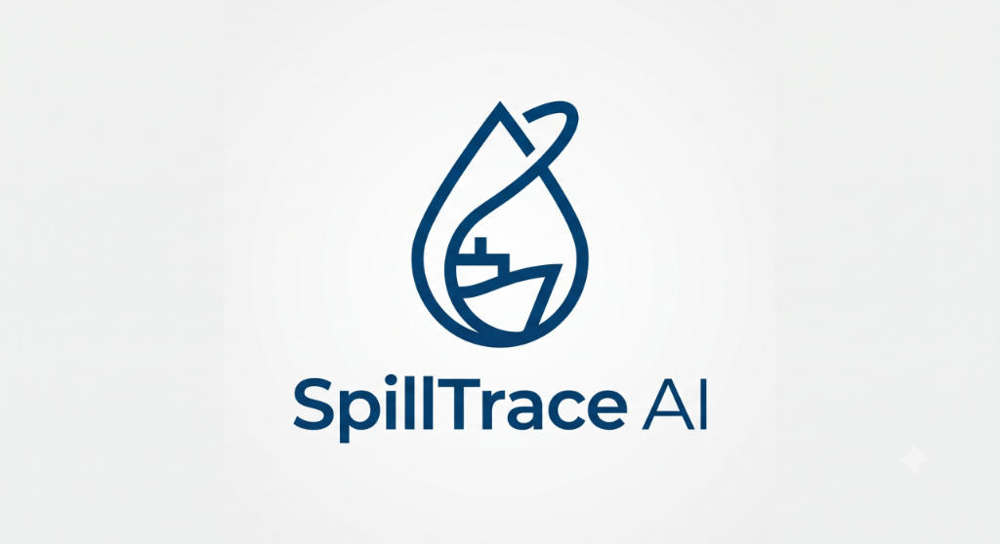

<p align="center">
  
</p>

# <p align="center">🌊 SpillTrace AI</p>

<p align="center">
  <strong>From Space to Suspect.</strong><br />
  An AI-powered maritime intelligence platform for satellite oil spill detection, ocean drift trajectory modeling, AIS vessel correlation, and environmental threat attribution.
</p>

<p align="center">
  <a href="https://spilltrace-ai.vercel.app"></a>
  <a href="https://github.com/Abhay2030/SpillTrace-AI"></a>
  <a href="https://nextjs.org/"></a>
  <a href="https://www.typescriptlang.org/"></a>
  <a href="https://threejs.org/"></a>
</p>

---

## 🌐 Live Application
Access the production application live on Vercel:  
👉 **[https://spilltrace-ai.vercel.app](https://spilltrace-ai.vercel.app)**

---

## 📌 Project Overview

**SpillTrace AI** bridges the intelligence gap between detection and attribution in maritime oil spill incidents. While satellite imagery can detect slicks on the ocean surface, identifying responsible vessels remains a complex challenge.

SpillTrace AI combines satellite detection, oceanographic drift modeling, historical AIS (Automatic Identification System) vessel traffic correlation, and explainable AI attribution into a unified, interactive 3D command platform.

### Key Capabilities
- 🛰️ **Satellite Detection & Characterization**: Ingests and processes multi-spectral satellite imagery to detect and map oil slick boundaries.
- 🌊 **Backward & Forward Drift Modeling**: Simulates ocean current, wind, and hydrodynamic forces to rewind spill trajectories back to origin points and project future dispersion.
- 🚢 **AIS Vessel Correlation**: Filters maritime traffic in space and time to identify candidate vessels operating within target slick origins.
- 🎯 **Attribution & Explainability**: Calculates confidence scores and provides verifiable evidence graphs linking suspects to environmental damage.
- ⚠️ **Threat Assessment**: Evaluates potential impact on coastal ecosystems, protected marine sanctuaries, and commercial shipping lanes.
- 🌐 **Interactive 3D WebGL Visualization**: Built with Three.js / React Three Fiber for immersive cinematic exploration of global ocean telemetry.

---

## 🛠️ Tech Stack

- **Framework**: [Next.js 16](https://nextjs.org/) (App Router, Turbopack)
- **Language**: [TypeScript](https://www.typescriptlang.org/)
- **3D & Graphics**: [Three.js](https://threejs.org/), `@react-three/fiber`, `@react-three/drei`, GSAP
- **State Management**: [Zustand](https://zustand-demo.pmnd.rs/)
- **Styling**: Tailwind CSS
- **Deployment**: [Vercel](https://vercel.com)

---

## 🚀 Getting Started

### Prerequisites
- Node.js 18+
- npm / yarn / pnpm

### Installation & Local Setup

```bash
# Clone the repository
git clone https://github.com/Abhay2030/SpillTrace-AI.git

# Navigate into project directory
cd SpillTrace-AI

# Install dependencies
npm install

# Run development server
npm run dev
```

Open [http://localhost:3000](http://localhost:3000) in your browser to run locally, or visit the live deployment directly at [https://spilltrace-ai.vercel.app](https://spilltrace-ai.vercel.app).

---

## 📄 License
This project is licensed under the MIT License - see the [LICENSE](LICENSE) file for details.
